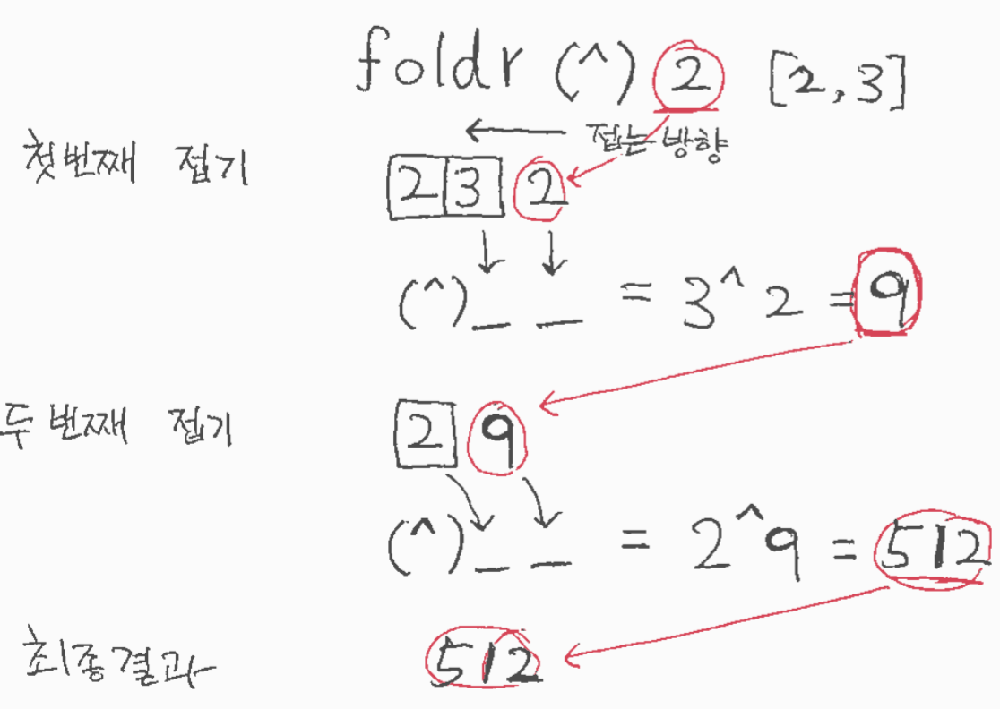
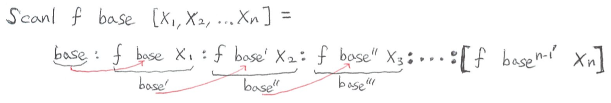
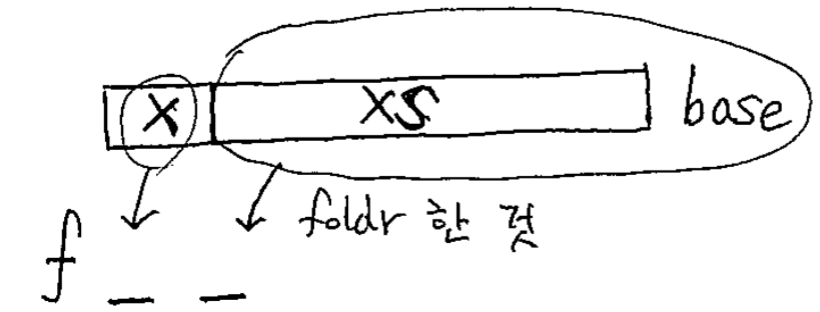
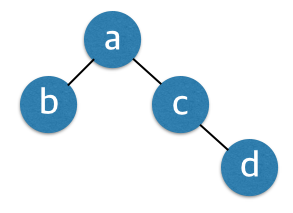
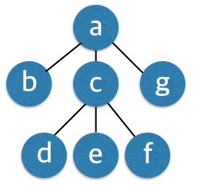

# 하루만 배워보는 Haskell Programming

Haskell Programming을 딱 하루만 배워봅시다.

사전학습을 포함하여 약 8시간 가량 Haskell을 배워서 Haskell programming의 기초개념들을 잘 익혀봅시다. 이 과정을 마치면 다음 개념 및 용어에 익숙해지길 기대합니다.

First-class citizen, Higher-order function, Pure function, Lambda expression, Immutability, Maybe type, Currying, Partial application, Function composition, Typeclass, Type system, Type inference, Lazy evaluation, Binding, Pattern matching, Guard, List comprehension, Functor, Monoid, Value with context

본 과정은 대체로 거꾸로 교실(Flipped classroom) 형태로 진행이 되며 일부 핵심 개념들은 강사가 직접 설명합니다.

## 사전 학습
- [x] Type system
- [x] Higher order function
- [x] Binding
- [x] Immutability
- [x] Pattern matching
- [x] Lambda expression

[Haskell platform](https://www.haskell.org/platform/)을 설치합니다. 설치후 ghci (Glasgow Haskell Compiler Interactive shell)를 실행합니다.

    $ ghci
    GHCi, version 7.10.2: http://www.haskell.org/ghc/  :? for help
    >

Haskell의 기본 자료형은 List입니다. List는 대괄호로 표시합니다. Haskell에서 한 줄 주석은 수평선 두 개로 표시합니다. 이 문서에는 편의상 한 줄 주석을 expression의 실행결과를 표시할 때 사용하도록 하겠습니다.

```haskell
[1,2,3] -- [1,2,3]
```

List를 만들 때는 여러 가지 편리한 방법이 있습니다.

```haskell
[1..5] -- [1,2,3,4,5]
[1,4..20] -- [1,4,7,10,13,16,19]
[5,4..1] -- [5,4,3,2,1]
[10,8..1] -- [10,8,6,4,2]
```

List에 사용할 수 있는 기본 함수들을 살펴봅니다.

```haskell
sum [1,2,3] -- 6
product [1,2,3] -- 6
length [1,2,3] -- 3
head [1,2,3] -- 1
tail [1,2,3] -- [2,3]
init [1,2,3] -- [1,2]
last [1,2,3] -- 3
take 2 [1,2,3] -- [1,2]
drop 2 [1,2,3] -- [3]
0:[1,2,3] -- [0,1,2,3]
[1,2,3] ++ [4,5,6] -- [1,2,3,4,5,6]
maximum [1,2,3] -- 3
minimum [1,2,3] -- 1
reverse [1,2,3] -- [3,2,1]
concat [[1,2],[3],[4,5]] -- [1,2,3,4,5]
```

Haskell 에서는 모든 동작에 있어서 함수가 중심이 됩니다. 위의 예에서 볼 수 있들이 List 에 어떤 함수를 적용할 때는 "함수 List" 꼴로 적용할 함수가 먼저 나오고 그 뒤에 List가 나옵니다.
가령 sum 함수의 경우 "sum [1,2,3]" 꼴로 호출이 되었습니다. Haskell에서는 함수를 값에 적용하는 function application이 모든 연산 중에서 가장 우선 순위가 높습니다. function application 은 함수와 인자 사이에 공백을 두면 이루어집니다. 공백이 일종의 function application 연산자인 셈입니다. 물론 실제로 공백이 연산자라는 뜻은 아닙니다. 그래서 Haskell에서 함수 호출은 함수이름 + 공백 + 함수인자 꼴로 이루어집니다. f 가 함수이고 x 가 인자일 때 f x 가 곧 함수 호출이 됩니다. C, Java등의 언어에서 f(x) 꼴로
함수 호출이 이루어지는 것과 비교하면 낯설지만 우리가 수학 책에서 보던 함수 수식과 거의 같다고 생각하면 낯설음이 덜합니다.

    > let a = 2; b = 3;
    > (+) 2 3
    5
    > let xs = [1,2,3]
    > sum xs
    6

sum 함수는 List를 하나 받아서 그List의 원소들의 합을 구하는 함수 입니다. 다시 말해 sum함수의 입력은 "List 하나"이고 출력은 "값 하나" 꼴이 됩니다. 이렇듯 함수의 입력과 출력관계를 정의할 수 있는데 이를 함수의 type이라고 합니다. ghci에서는 :type 명령(혹은 :t) 을 사용하여 어떤 함수의 type을 알 수 있습니다.

    > :t sum
    sum :: (Num a, Foldable t) => t a -> a

함수 이름 sum 뒤에 나오는 :: 기호 뒷 부분이 sum 함수의 type입니다. 그 중에서도 => 기호 뒷부분이 핵심입니다. 즉, 여기서는 "t a -> a" 부분만 보면 됩니다. => 기호 앞에 나오는 Num이나 Foldable은 나중에 다시 다루겠습니다. t a -> a 를 해석해 보면 입력(t a)으로는 '리스트 하나'를 받고 출력(a) 으로는 '값 하나' 를 내놓는 함수가 됩니다.
 화살표 기호 -> 의 앞과 뒤가 각각 입력과 출력을 뜻합니다. 즉, "입력" -> "출력" 꼴이 됩니다. 화살표가 여러 개 있을 때는 마지막 화살표의 뒤가 출력이 되고 그 이전의 것들은 모두 입력이 됩니다. 즉, a -> b -> c -> d 꼴 함수인 경우 "입력1" -> "입력2" -> "입력3" -> "출력" 을 뜻합니다.
참고로 모든 함수는 반드시 소문자로 시작해야 합니다. 즉, 함수이름으로 Sum 은 불가능합니다. Haskell에서는 대소문자가 문법적으로 의미가 있습니다.

    > take 2 [1,2,3]
    [1,2]
    > :t take
    take :: Int -> [a] -> [a]

take 함수는 입력으로 인자를 두 개 받는데 첫번째(Int)는 Int type의 인자이고 두 번째는 List([a]) 입니다. 그리고 출력으로는 List 하나([a])를 내놓습니다.

Haskell에서 type 은 모든 것에 있습니다.

    > :t [1,2,3]
    [1,2,3] :: Num t => [t]

[1,2,3] 은 각 요소가 숫자인 List 입니다.

Haskell은 순수 함수형 프로그래밍 언어입니다. 함수형 프로그래밍의 가장 큰 특징은 함수가 first-class citizen 이라는 것입니다. 즉, 함수가 함수의 인자로 들어갈 수도 있고 함수 실행의 결과로도 나올 수 있습니다. 일반적인 값을 다루듯이 함수를 다룰 수 있습니다. 이러한 함수를 고차 함수 higher-order function 이라고 합니다. 대표적인 고차함수로는 map, filter, fold 가 있습니다.

    > map (*2) [1,2,3]
    [2,4,6]
    > :t map
    map :: (a -> b) -> [a] -> [b]

map 함수는 (a -> b) 꼴 함수 하나와 [a] 꼴 List 하나를 받아서 [b] 꼴 List 를 결과로 내놓는 함수 입니다. map 함수를 다음처럼 재귀적으로 구현할 수 있습니다.

    >:{
    Prelude| let my_map::(a->b) -> [a] -> [b]
    Prelude|     my_map f [] = []
    Prelude|     my_map f (x:xs) = f x:my_map f xs
    Prelude| :}

위의 코드에서 (x:xs) 와 같은 것을 pattern matiching이라고 합니다. 다음 코드를 보세요.

    > let (a:as) = [1,2,3]
    > a
    1
    > as
    [2,3]

즉, List [1,2,3] 을 (a:as) 꼴 패턴에 대응하여 각각 a 와 as 의 값을 정하는 것입니다.
my_map 함수의 구현 코드에서 my_map 함수의 정의부가 두 번 등장하는 것도 pattern matching입니다. 즉 빈 List일 경우([] 꼴)와 빈 List가 아닐 경우(x:xs 꼴) 두 경우의 pattern에 대하여 각각 함수 구현을 달리하는 것입니다. Pattern matching 예를 하나 더 보겠습니다.

    > :{
    Prelude| let halves [] = ([],[])
    Prelude|     halves [x] = ([x],[])
    Prelude|     halves (x:y:ys) = (x:u, y:v) where (u,v) = halves ys
    Prelude| :}

위 코드의 halves 함수는 List를 두 개의 List로 나누는 일을 합니다. 위 코드를 보면 halves 함수의 정의가 세 번 나오고 있습니다. 빈 List일 때, 원소가 하나인 List일 때, 그 이외의 경우 이렇게 세 경우에 대한 pattern matching을 하고 있습니다. where 라는 새로운 문법이 나왔는데, 이는 지역변수를 선언할 때 사용합니다.

한편, ghci 에서 여러 줄에 걸쳐 코드를 작성하려면 :{ 로 시작하고 :} 로 끝내면 됩니다. 이 때, :{ 와 :} 가 있는 줄에는 다른 것은 쓰지 않아야 합니다.

그리고 ghci에서는 어떠한 변수에 값을 줄때는 let 구문을 써야 합니다. 이러한 것을 binding 이라고 합니다. 함수형 프로그래밍에서는 변수 할당(assignment)의 개념이 존재하지 않습니다. (주의할 점은 함수형 프로그래밍 언어 중에도 변수 할당을 지원하는 언어가 있습니다. 예를 들어 Scala 언어에서는 할당 연상이 가능한 var 와 불가능한 val 두 가지가 모두 있습니다. 이는 프로그래밍 언어와 프로그래밍 패러다임과의 차이이며 Haskell은 순수 함수형 언어이기 때문에 변수 할당 개념이 없습니다.) 대신 binding이라는 말을 쓰며 한 번 binding된 것은 이후에 값이 바뀌지 않습니다. 다음 코드를 보세요.

    > let a = 1
    > a = 2

    <interactive>:3:3: parse error on input ‘=’

변수 a 에 1이라는 값을 binding한 후에 다시 변수 a에 2라는 값을 할당하려고 하니 오류가 났습니다. 우리가 기존에 익숙한 C, Java와 같은 언어에서는 변수 assignment가 매우 자연스러우나 함수형 프로그래밍에서는 한 번 값이 변수에 묶인 후에는 또 다시 binding 하지 않는 이상 값은 변하지 않습니다. 이러한 것을 불변성(Immutability)라고 하며 함수형 프로그래밍의 중요 개념 중 하나입니다. C, Java 언어에 비추어 생각해보면 모든 변수와 객체에 const, final 이 기본으로 붙어 있다고 보면 비슷합니다.

    > filter odd [1,2,3]
    [1,3]
    > filter (>5) [1,6,3,8,5]
    [6,8]
    > :t filter
    filter :: (a -> Bool) -> [a] -> [a]

filter 함수는 (a -> Bool) 꼴 함수 하나와 [a] 꼴 List 하나를 받아서 [a] 꼴 List 하나를 결과로 내놓는 함수입니다. (a -> Bool) 꼴 함수는 많이 등장하는 형태이어서 특별히 Predicate 이라고 부릅니다. filter 함수가 하는 일은 List의 원소들 중에서 Predicate을 만족하는 것들만 골라내는 것입니다.

```haskell
foldl (/) 1000 [2,5] -- 100.0
foldr (/) 1000 [2,5] -- 400.0
```

fold함수는 folding 방향에 따라 foldl과 foldr 두 개의 함수가 있습니다.

    > foldr (^) 2 [2,3]
    512
    > :t foldr
    foldr :: Foldable t => (a -> b -> b) -> b -> t a -> b
    > foldl (^) 2 [2,3]
    64
    > :t foldl
    foldl :: Foldable t => (b -> a -> b) -> b -> t a -> b

먼저 foldr 함수는 (a -> b -> b) 꼴 함수 하나와 b 꼴 값 하나, 그리고 t a 꼴 List 하나(사실 Foldable은 List 보다 좀 더 포괄적인 개념이지만 일단 여기서는 List에 대해서만 생각하기로 합니다)를 입력으로 받아서 b 꼴 값을 하나 내놓는 함수 입니다. foldr 함수는 이름 그대로 List처럼 여러 요소를 갖고 있는 자료형을 하나의 값으로 접는(fold) 일을 합니다. 여기서 끝에 붙은 r 은 right의 뜻으로 foldr은 접기가 오른쪽에서 왼쪽으로(*right* to left) 진행됩니다. 반대로 foldl은 왼쪽에서 오른쪽으로(*left* to right) 접어들어갑니다. 동풍이 동쪽에서 불어오는 바람이듯이 foldr 은 오른쪽에서부터 접어들어가고 foldl은 왼쪽에서부터 접어들어갑니다.

다음 그림이 foldr 의 동작을 설명해 주고 있습니다.


foldr, foldl 함수는 for-loop 나 재귀를 더욱 추상화한 것입니다. 특히 foldr 함수는 다른 고차 함수들을 만들 수 있는 함수이므로 매우 중요합니다. 예를 들어 filter 함수를 재귀적으로 다음처럼 만들 수 있습니다.

```haskell
{-
  my_filter.hs
  Haskell에서 여러 줄 주석은 {- 로 시작하고 -} 로 끝납니다.
-}
my_filter:: (a -> Bool) -> [a] -> [a]
my_filter f [] = []
my_filter f (x:xs) = if f x
                     then x:my_filter f xs
                     else my_filter f xs
```

    > :l my_filter.hs
    [1 of 1] Compiling Main             ( my_filter.hs, interpreted )
    Ok, modules loaded: Main.

앞서 my_map 함수 정의할 때 처럼, ghci에서 여러 줄에 걸쳐 함수를 정의하는 것은 불편합니다. 그래서 이제부터는 소스파일을 만들고 이를 ghci에서 불러와서 사용하겠습니다. Haskell 소스파일은 확장자가 .hs 로 끝납니다. 그리고 이렇게 작성한 파일을 ghci에서 불러올 때는 :load 명령 또는 단축명령 :l 을 사용합니다. 그리고 소스파일에서 binding 할 때는 let을 쓰지 않습니다.

Haskell source 파일을 작성할 때는 off-side rule을 지켜야 합니다. 이는 축구의 off-side rule과 똑같은 맥락이며 들여쓰기를 할 때 계층을 맞추어주어야 합니다. 예를 들어 다음과 같이 작성하면 파일을 불러올 때 오류가 납니다.

```haskell
compareLength::String -> String -> Ordering
 compareLength x y = compare (length x) (length y)
```

그 이유는 같은 compareLength 함수의 type signature와 함수 정의부는 정의의 계층이 같기에 서로 들여쓰기 계층이 맞아야 하는데, 위에서는 compareLength함수 정의부가 그것의 type signature와 들여쓰기 깊이가 다르기 때문입니다. 참고로 들여쓰기를 지키는 대신 { 와 } 를 써서 명시적으로 묶어주어도 됩니다. Off-side rule을 가지는 프로그래밍 언어는 이외에도 Python, F# 등이 있습니다.

foldr 함수와 foldl 함수는 각각 foldr1, foldl1 이라는 자매 함수가 있는데, 이 함수들은 기본값(base)을 받지 않습니다. 즉, List에서 첫번째로 fold하는 원소를 기본값으로 삼습니다.

```haskell
foldr1 (+) [1,2,3,4] -- 10
foldl1 (++) ["I","Love","You"] -- "ILoveYou"
```

주의할 점은 이 함수들은 기본값이 애초에 없기 때문에 비어있는 List에 적용하면 에러가 납니다.

    > foldl1 (+) []
    *** Exception: Prelude.foldl1: empty list


다음으로 if..then..else 구문이 나왔습니다. 이는 자명하므로 설명하지 않겠습니다.

우리가 filter 함수를 재귀적으로 구현했는데, foldr 함수는 재귀를 보다 추상화한 함수이기 때문에 재귀적으로 구현할 수 있는 코드는 foldr 로도 구현할 수 있습니다. 이제 filter 함수를 foldr 로 구현해보겠습니다.

```haskell
my_filter f xs = foldr (\x base -> if f x then x:base else base) [] xs
```

위 코드에서 (\x base -> ...) 은 Lambda expression이라고 부르는 것으로 익명 함수를 편하게 정의할 수 있게 합니다. Lambda expression은 \ (backslash) 기호로 시작합니다. \ 기호 다음에 함수 인자 목록이 오고 그 다음 화살표 -> 가 옵니다. 화살표 오른쪽에는 함수몸체가 옵니다.

'\' 기호 | 함수 인자 목록 | 화살표| 함수 몸체
:-----:|:--------------:|:-----:|:------:
__\__  | x base         |__->__ | if f x then x:base else base

(\x base -> ...) 부분 전체는 이름 없는 함수로서 두 개의 인자 x와 base를 받습니다. Lambda expression의 사용 예는 다음과 같습니다.

    > (\x y -> x + y) 2 3
    5
    > let add = \ a b -> a + b
    > add 2 3
    5

foldr을 쓰니 재귀를 명시적으로 쓰지 않고도 filter 함수를 구현할 수 있었습니다. 그 이유는 foldr 이 재귀를 추상화한 함수이기 때문입니다.

사전 학습은 여기까지입니다. 숙제1~5를 세미나 참석 전까지 제출해주시기 바랍니다. 숙제제출은 세미나 참석 요건입니다.

숙제1) sum 함수를 재귀적으로 직접 만들어보세요.
```haskell
my_sum:: Num a => [a] -> a
my_sum [] = 0
my_sum (x:xs) = ?
```

숙제2) tak 함수를 재귀적으로 직접 만들어보세요. 아래 코드에서 밑줄이 뜻하는 바는 해당 위치에 오는 변수에 대해서 신경쓰지 않겠다는 뜻입니다. 예를 들어 빈 List에 대해서는 몇 개의 항목을 가져올 지가 무의미하기 때문에 해당 변수를 사용할 일이 없고 그렇기 때문에 신경쓰지 않겠다는 뜻으로 밑줄로 표시하는 것입니다.
```haskell
my_take:: Int -> [a] -> [a]
my_take _ [] = []
my_take 0 _ = []
my_take n (x:xs) = ?
```

숙제3) foldr 함수를 써서 sum 함수를 직접 만들어보세요.
```haskell
my_sum2:: Num a => [a] -> a
my_sum2 xs = ?
```

숙제4) foldr 함수를 써서 map 함수를 직접 만들어보세요.
```haskell
my_map:: (a -> b) -> [a] -> [b]
my_map f xs = ?
```

숙제5) foldl 함수를 써서 reverse 함수를 직접 만들어 보세요.
```haskell
my_reverse:: [a] -> [a]
my_reverse = foldl ? ?
```

## 숙제 복기 및 사전학습 질의응답 시간
시작하기에 앞서 숙제를 함께 복기해 보고 사전학습 내용에 대한 질의응답을 하겠습니다.

## 첫 1시간
- [x] Lazy evaluation
- [x] List comprehension

List에 대해 더 알아봅시다. zip 함수가 있습니다. zip 함수는 이름 그대로 바지 지퍼처럼 두 개의 List의 각 원소들을 1:1 로 묶어줍니다.

    > zip [1,2,3] ['a','b','c']
    [(1,'a'),(2,'b'),(3,'c')]
    > :t zip
    zip :: [a] -> [b] -> [(a, b)]

zip 함수의 실행 결과에서 새로운 자료형이 등장합니다. 바로 Tuple 입니다. Haskell에서 List는 homogeneous 자료형입니다. [1,'a',"xyz"] 같은 것은 불가능합니다. 반면에 Tuple은 heterogenous 자료형입니다.

Tuple은 위의 예처럼 원소 두 개짜리 뿐만 아니라 (1,'a',True) 같은 세 개, 네 개 짜리도 가능합니다. 원소가 두 개짜리인 Tuple을 특별히 Pair라고 부르는데 다음과 같은 함수를 사용할 수 있습니다.

```haskell
fst (1,'a') -- 1
snd (1,'a') -- 'a'
```

특별히 Pair를 만들 때는 (,) 연산자를 쓸 수도 있습니다.

```haskell
(,) 2 True -- (2, True)
```

원소가 세개 짜리인 Tuple, 즉 Triple들을 List 세 개로부터 만들려면 어떻게 해야 할까요? Haskell에서는 zip3 라는 함수도 있습니다. 참고로 zip7 까지 함수가 있습니다.

```haskell
zip3 [1,2] ['a','b'] [True, False] -- [(1,'a',True),(2,'b',False)]
```

zipWith 란 함수도 있습니다. 이 함수는 Tuple로 만드는 대신 주어진 함수를 가지고 두 개 List의 각 원소에 대한 연산을 수행합니다.

```haskell
zipWith (+) [1,2,3] [10,20,30,40] -- [11,22,33]
```
사실 앞서 배운 zip 함수는 zipWith 함수를 써서 구현할 수 있습니다.

    > let zip = zipWith (,)

zipWith 함수도 zip함수처럼 zipWith3 부터 zipWith7 까지 인자 갯수에 따라 자매 함수들이 있습니다.

연습1) zipWith 를 재귀적으로 구현해 보세요.

```haskell
my_zipWith f [] _ = []
my_zipWith f _ [] = []
my_zipWith f (x:xs) (y:ys) = ?
```

zip함수와 반대로 동작하는 unzip 함수도 있습니다.

```haskell
unzip [(1,True),(2,False),(3,True)] -- ([1,2,3], [True, False, True])
```

연습2) unzip 함수를 foldr을 써서 구현해보세요.

```haskell
my_unzip xs = foldr ? ([],[]) xs
```

List를 반복적으로 편리하게 만들어 주는 함수들이 있습니다.

```haskell
replicate 3 1 -- [1,1,1]
take 3 (repeat [1,2]) -- [[1,2],[1,2],[1,2]]
take 3 (cycle [1,2]) -- [1,2,1]
```
그런데 repeat와 cycle 함수를 보면 take 함수를 써서 일부 결과물만 가져오고 있습니다. 그 이유는 repeat 와 cycle 함수는 무한수열을 만들기 때문입니다. Haskell에서는 무한수열을 아주 쉽게 사용할 수 있는데 그 이유는 Haskell에서는 lazy evaluation 이 기본이기 때문입니다. Lazy evaluation에서는 필요할 때까지 expression을 평가하지 않습니다. List를 선언할 때 List의 끝을 정해주지 않으면 무한수열 형태로 선언할 수 있습니다.

```haskell
take 3 [1..] -- [1,2,3]
take 5 [1,3..] -- [1,3,5,7,9]
```

Lazy evalution에서는 값이 필요할 때까지 expression은 expression그대로 남아 있습니다. 예를 들어 [1..] 라는 expression은 어떠한 값도 아닌 그냥 expression입니다. 그러다가 take 2 함수처럼 값을 요구하는 것이 오면 그제서야 맨 앞 2개 요소를 값으로 평가합니다. 즉 1:2:[3..] 가 되어버립니다. [3..] 부분은 여전히 expression으로 남아있게 됩니다.

무한수열을 만드는 또 다른 함수는 iterate 입니다.

```haskell
take 5 (iterate (\x -> x^2) 2) -- [2,4,16,256,65536]
take 5 (iterate (map (*2)) [1,2,3]) -- [[1,2,3],[2,4,6],[4,8,12],[8,16,24],[16,32,48]]
```

연습3) iterate 함수를 재귀적으로 구현해 보세요.
```haskell
my_iterate f x = x:?
```

연습4) Haskell의 lazy evaluation 덕분에 fibonacci 수열을 매우 간단하게 만들 수 있습니다. 다음 코드를 완성하세요.
```haskell
fib = 1:1:zipWith (+) ? ?
take 10 fib -- [1,1,2,3,5,8,13,21,34,55]
fib!!10 -- 89
```

fold 함수가 여러 개의 값을 하나로 줄여버리는데 반해 scan 함수는 값을 계속 누적해 나갑니다. scanl 과 scanr 함수가 있습니다.

```haskell
scanl (+) 0 [1..10] -- [0,1,3,6,10,15,21,28,36,45,55]
scanr (+) 0 [1..10] -- [55,54,52,49,45,40,34,27,19,10,0]
```

scanl 함수의 동작은 다음 수식처럼 표현할 수 있습니다.


연습5) scanl 함수를 재귀적으로 직접 만들어 보세요. iterate 함수 만든 것과 매우 비슷합니다. iterate와 scan 둘 다 직전에 계산한 결과를 이용하기에 매우 비슷합니다.
```haskell
my_scanl _ base [] = [base]
my_scanl f base (x:xs) = base:?
```

연습6) iterate 함수를 scanl을 써서 구현해 보세요.
```haskell
my_iterate f x = scanl ? ? ?
```

연습7) fibonacci 수열을 scanl을 써서 만들어 보세요.
```haskell
fib = 1:scanl (+) 1 ?
```

List를 만드는 또 다른 방법으로는 List comprehension이 있습니다. Python programming을 해 보신 분들은 List comprehension에 매우 익숙하실 겁니다.

```haskell
[x | x <- [1..10], odd x] -- [1,3,5,7,9]
[x*y | x <- [1..3], y <- [10,11]] -- [10,11,20,22,30,33]
```

x <- [1..10] 부분은 generator로서 숫자들을 만들어 내고 있고 odd x 는 filter로서 generator가 만든 숫자들 중 조건에 맞는 것만 걸러내고 있습니다. x <- [1..3], y <- [10,11] 처럼 generator는 여러 개가 있을 수 있습니다.

List comprehension은 우리가 수학책에서 보던 다음과 같은 set-builder notation을 프로그래밍 언어로 옮겨온 것으로 볼 수 있습니다.

    {x|x ∈ ℝ ∧ x > 0}

List comprehension을 이용하여 isPrime 함수를 만들겠습니다.

```haskell
isPrime n = 2 == length [d | d <- [1..n], n `mod` d == 0]
zip [1..] $ map isPrime [1..10] -- [(1,False),(2,True),(3,True),(4,False),(5,True),(6,False),(7,True),(8,False),(9,False),(10,False)]
```

새로운 문법이 나왔습니다. mod 함수는 modulo 연산자입니다. mod 7 2 의 결과는 1 입니다. 그런데 mod 함수와 같은 이항연산자는 보통 중위표기로 쓰는 것이 읽기 편합니다. 그래서 Haskell에서는 이항연산자를 중위표기법으로 쓸 때는 backtick 으로 감싸줍니다. \`mod\` 이런 식으로. 다음 코드를 보세요.
```haskell
div 5 2 -- 2
5 `div` 2 -- 2
```

$ 연산자는 우선 순위가 가장 낮은 연산자 입니다. $ 연산자는 괄호를 쓰는 불편함을 덜기 위해 있습니다. 즉, 위의 코드에서 `zip [1..] (map isPrime [1..10])` 라고 써야 할 코드가 $ 연산자를 이용해서 괄호 없이 `zip [1..] $ map isPrime [1..10]` 으로 작성될 수 있었습니다.

이제 isPrime 함수를 써서 다음처럼 소수의 목록을 구할 수 있습니다.

```haskell
prime = filter isPrime [1..]
take 10 prime -- [2,3,5,7,11,13,17,19,23,29]
```

연습8) 방금 만든 prime 함수는 사실 비효율적입니다. iterate 함수와 다음의 sieve 함수를 이용하여 에라토스테네스의 체를 이용한 보다 빠른 소수생성 함수를 만드세요. 참고로 아래 코드에서 /= 연산자는 "같지 않음"을 검사합니다. 수학의 같지 않음을 뜻하는 기호 ≠ 와 닮아있습니다.

```haskell
sieve (p:xs) = [x|x<-xs, x `mod` p /= 0]
prime = ?
```

## 두 번째 시간
- [x] Typeclass
- [x] Functor


지금까지 배운 것을 바탕으로 Mergesort를 구현하는 연습을 해 보겠습니다.

연습9) merge 함수를 구현하세요. 아래 코드에서 @ 기호를 사용한 부분은 as pattern 이라고 부르는 것으로 pattern matching된 전체 부분을 뜻합니다. 가령 xall@(x:y:ys) = [1,2,3] 인 경우에 x, y, ys 는 각각 1, 2, [3] 에 binding되고 xall 은 pattern matching된 전체 부분인 [1,2,3] 에 binding됩니다.

```haskell
merge:: Ord a => [a] -> [a] -> [a]
merge [] ys = ys
merge xs [] = xs
merge xall@(x:xs) yall@(y:ys) = ?

merge [1,2,3,4] [3,6,9] -- [1,2,3,3,4,6,9]
```

연습10) 위의 merge 함수를 이용하여 다음 mergeSort 함수를 구현하세요.

```haskell
mergeSort:: Ord a => [a] -> [a]
mergeSort [] = []
mergeSort [a] = ?
mergeSort xs = ?
```

이번에는 foldr 함수를 재귀적으로 직접 구현해보겠습니다.

```haskell
my_foldr:: (a -> b -> b) -> b -> [a] -> b
my_foldr f base [] = base
my_foldr f base (x:xs) = ?
```

이는 그림을 그려보면 직관적으로 코드를 작성할 수 있습니다. 다음 그림을 봅시다.


즉, 함수 f의 두번째 인자는 해당 부분만큼을 또 다시 foldr한 것이 됩니다. 따라서 다음처럼 코드를 작성할 수 있습니다.

```haskell
f x (my_foldr f base xs)
```

연습11) foldl 함수를 위의 my_foldr 함수에서 했던 것처럼 재귀적으로 직접 구현해 보세요.

```haskell
my_foldl:: (b -> a -> b) -> b -> [a] -> b
my_foldl f base [] = base
my_foldl f base (x:xs) = ?
```

"Hello, world!" 와 같은 문자열을 Haskell 에서는 String이라고 부릅니다. 이 String에 대한 작업을 수행하는 함수 중 하나로 words, unwords 가 있습니다.

    > words "Hello, world!"
    ["Hello,","world!"]
    > :t words
    words :: String -> [String]
    > unwords ["Jack","said","hello"]
    "Jack said hello"

그런데 "Hello, world!" 의 type은 String이 아니라 [Char] 로 나옵니다.

    > :t "Hello, world!"
    "Hello, world!" :: [Char]

그 이유는 Haskell에서 String은 별도의 type이 아니라 [Char]의 또 다른 이름입니다. 즉, String은 다음처럼 선언되어 있습니다.

```haskell
type String = [Char]
```

이러한 것을 type synonym이라고 부릅니다. Programmer가 일반적인 data type에 특별한 의미를 주기 위해 사용합니다.

```haskell
type Address = String
myOfficeAddr::Address
myOfficeAddr = "19, Yangjaedaero11-gil, Seocho-gu, Seoul, South Korea, Planet Earth"
```

이번에는 실제로 새로운 type을 정의해 보겠습니다. data 라는 keyword를 사용하면 사용자 정의 data type을 만들 수 있습니다.

```haskell
data Gender = Male | Female | Unknown deriving (Show, Eq)
```

이렇게 하면 Gender 라는 새로운 type이 생깁니다. 해당 type의 값은 Male 또는 Female 또는 Unknown입니다. 이 세 가지 값은 방금 우리가 직접 전역으로 선언해 준 것입니다. Male, Female, Unknown 처럼 Gender type의 값을 이루는 것을 value constructor라고 합니다. type을 만들 때는 반드시 대문자로 시작하여야 하고 type의 값도 반드시 대문자로 시작해야 합니다.

    > :t Male
    Male :: Gender
    > :t Female
    Female :: Gender

deriving이라는 새로운 문법이 나왔는데, 이는 typeclass란 것과 관련있습니다. deriving Show 라는 것은 Gender라는 type이 Show라는 typeclass에 속해있다는 것을 말하는 것으로 Male, Female, Unknown 이라는 값을 문자열로 출력할 수 있다는 것을 컴파일러에게 알려줍니다. Eq의 경우 Gender type을 비교를 할 수 있는 type으로 만들기 위해 필요합니다. deriving 뒤에 올 수 있는 typeclass의 종류는 6개로 Eq, Ord, Enum, Bounded, Show, Read 입니다. 여기서는 typeclass는 Java의 interface와 비슷하다고 생각하고 넘어갑니다. 뒤에서 더 다루겠습니다.

이제 새로 만든 Gender type을 이용하는 함수를 하나 만들겠습니다.

```haskell
sayHello:: Gender -> String
sayHello gender
    | gender == Male = "Good morning, sir."
    | gender == Female = "Good morning, ma'am."
    | otherwise = "Good morning, mysterious people."
```

새로운 문법이 나왔는데, 수직선(|)을 사용하여 조건 분기하는 이러한 문법을 guard 라고 부릅니다. guard 문법의 otherwise 부분은 if..then..else 구문의 else에 해당합니다.

자료형은 재귀적으로도 선언이 가능합니다. 자연수를 뜻하는 자료형을 만들어 보겠습니다.

```haskell
data Natural = Zero | Succ Natural deriving (Show, Eq)
```

이제 Natural 자료형은 값으로 Zero, Succ Zero, Succ (Succ Zero), Succ (Succ (Succ Zero)), ... 등 무한개의 값을 가질 수 있습니다.

재귀적인 구조의 자료형을 하나 더 만들어보겠습니다. 이진트리를 만들겠습니다.

```haskell
data BinTree a = Empty | Fork a (BinTree a) (BinTree a) deriving Show
myTree = Fork 'a' (Fork 'b' Empty Empty) (Fork 'c' Empty (Fork 'd' Empty Empty))
myTree2 = Fork 1 (Fork 2 Empty Empty) (Fork 3 Empty (Fork 4 Empty Empty))
```


여기서 BinTree a 라는 새로운 자료형을 정의하였습니다. BinTree a 자료형에서 BinTree를 type constructor라고 부르며 a 는 type parameter입니다. a 의 type에 의해 전체 Tree의 type이 결정됩니다. 즉, BinTree a 라는 자료형은 polymorphic 합니다. 이러한 것을 parametric polymorphism이라고 부르며 C++의 templates 이나 Java의 Generics 가 이와 같은 개념입니다.

    > :t myTree
    myTree :: BinTree Char
    > :t myTree2
    myTree2 :: Num a => BinTree a

사전 학습에서 나온 => 기호에 대해 여기서 설명하겠습니다. 이는 Typeclass constraint라고 부르는 부분으로 type parameter 'a'가 어느 Typeclass에 속하는지를 밝히는 것입니다. 즉, Num 이라는 Typeclass에 속하는 Int, Float 등의 type이 해당 위치에 올 수 있다는 뜻입니다.

연습12) BinTree의 총 노드 갯수를 구하는 함수를 만들어보세요.
```haskell
treeSize:: BinTree a -> Int
treeSize Empty = 0
treeSize (Fork a l r) = ?
```

이번에는 tree에 항목을 추가하는 함수를 만들어보겠습니다. 각 원소가 중복되지 않는 Tree라고 가정하겠습니다.
```haskell
treeInsert:: Ord a => a -> BinTree a -> BinTree a
treeInsert x Empty = Fork x Empty Empty
treeInsert x t@(Fork y l r) = case x `compare` y of
                                EQ -> t
                                LT -> Fork y (treeInsert x l) r
                                GT -> Fork y l (treeInsert x r)
myTree3 = Fork 10 (Fork 3 Empty Empty) (Fork 12 Empty Empty)
treeInsert 5 myTree3 -- Fork 10 (Fork 3 Empty (Fork 5 Empty Empty)) (Fork 12 Empty Empty)
```
새로운 문법이 나왔는데 case...of 구문은 C, Java의 switch 구문에 해당합니다. compare 함수는 두 개의 값이 같으면 EQ, 앞에 나온 것이 뒤에 나온 것보다 작은면 LT, 반대의 경우에는 GT 를 각각 반환합니다.

우리가 만든 이진 트리 자료형도 List에서 쓰던 map 같은 함수를 쓸 수 있으면 좋겠습니다. 가령 다음처럼.

```haskell
import Data.Char
treeMap toUpper myTree -- Fork 'A' (Fork 'B' Empty Empty) (Fork 'C' Empty (Fork 'D' Empty Empty))
```

위의 코드에서 toUpper 함수는 소문자를 대문자로 바꾸어 주는 함수로 Data.Char 모듈에 있습니다. 모듈을 가져오려면 위의 코드처럼 import 구문을 사용합니다.

연습13) 위의 treeMap 함수를 구현해보세요.
```haskell
treeMap::(a->b) -> BinTree a -> BinTree b
treeMap _ Empty = Empty
treeMap f (Fork a l r) = ?
```

그런데 이처럼 어떤 자료형에 map 같은 함수를 쓰는 것은 매우 쉽게 생각할 수 있고 또 자주 필요한 일입니다. 그래서 이처럼 어떤 자료형의 각 원소들의 값을 한꺼번에 바꿀 수 있는 자료형을 별도의 typeclass로 정의하고 있습니다. Fuctor라고 불리는 것이 바로 그것입니다. 이름이 낯설어서 어색하지만 뜻하는 바는 딱 하나입니다. 자료형이 가진 값을 한꺼번에 바꿀 수 있는 자료형이면 Functor라고 부를 수 있습니다.

```haskell
class Functor f where
    fmap :: (a -> b) -> f a -> f b
```

위의 코드는 Functor typeclass의 정의입니다. Typeclass 를 정의할 때는 위처럼 class 라는 키워드를 통해 합니다. 위의 코드에서 보이듯이 Functor typeclass 이기 위해서는 단 하나의 조건만 있으면 되는데, 바로 fmap 함수가 해당 자료형에 대하여 정의되어 있으면 됩니다. 우리는 이미 Functor 인 자료형을 하나 배웠습니다. 바로 List 입니다. List 에 대해 동작하는 map 함수의 type을 다시 확인해 봅시다.

```haskell
map :: (a -> b) -> [a] -> [b]
```

fmap 함수의 type에서 f 에 해당하는 부분을 List 표기로 바꾸면 그대로 map 함수의 type이 됨을 볼 수 있습니다. 어떤 자료형이 특정 typeclass이기 위해서는 어떤 자료형을 해당 typeclass의 instance로 선언하면 됩니다. List는 어떤 식으로 Functor의 instance로 선언되어 있는지 확인합시다.

```haskell
instance Functor [] where
    fmap = map
```

이를 통해 List에 대해서는 fmap 함수가 map 함수와 똑같이 동작함을 알 수 있습니다.

마찬가지로 우리가 만든 이진트리를 Functor로 만들려면 다음처럼 하면 됩니다.
```haskell
instance Functor BinTree where
    fmap = treeMap
```

그런데, 앞서 나온 deriving 문법의 역할은 어떤 자료형이 특정 typeclass에 속함을 뜻한다고 했습니다. 다시 말해 다음의 BinTree a 자료형 정의는 BinTree a 자료형이 Show 라는 typeclass의 instance임을 뜻하고 있습니다. 명시적으로 instance 키워드를 써서 정의해 주지 않고 deriving 만을 써서 BinTree a 자료형을 Show의 instance로 만들고 있습니다.
```haskell
data BinTree a = Empty | Fork a (BinTree a) (BinTree a) deriving Show
```
이러한 것들을 derived instance 라고 부르며 이것이 가능한 것은 앞서 말했듯이 Eq, Ord, Enum, Bounded, Show, Read 6개 뿐입니다. 이것들은 instance를 만드는 코드를 compiler가 자동으로 만들어줍니다.

이번에는 노드를 여러 개 가질 수 있는 Tree를 만들어보겠습니다.

```haskell
data RoseTree a = Branch a [RoseTree a] deriving Show
myTree3 = Branch 'a' [Branch 'b' [], Branch 'c' [Branch 'd' [], Branch 'e' [], Branch 'f' []], Branch 'g' []]
```


연습14) RoseTree를 Functor로 만들어보세요.

```haskell
instance Functor RoseTree where
    fmap f (Branch a ts) = ?
```

Tree 자료형은 map 뿐만 아니라 fold 하는 것도 자연스러운 자료형입니다. 이진 트리에 대하여 fold함수를 정의해 보겠습니다.

```haskell
foldBinTree f base Empty = base
foldBinTree f base (Fork a l r) = f a v
    where v = foldBinTree f i l
          i = foldBinTree f base r
```

새로운 문법인 where 가 나왔습니다. where 는 중간값이 필요할 때 사용하는 구문입니다.

이번에는 RoseTree에 대한 fold함수를 정의해 보겠습니다.

```haskell
type Forest a = [RoseTree a]
foldtree:: (a -> b -> c) -> ([c] -> b) -> RoseTree a -> c
foldtree f g (Branch a ts) = f a v
    where v = foldforest f g ts
foldforest:: (a -> b -> c) -> ([c] -> b) -> Forest a -> b
foldforest f g ts = ?
```

연습15) 위의 foldforest 함수를 완성해 보세요.

## 세 번째 시간
- [x] Maybe type
- [x] Function composition
- [x] Currying
- [x] Partial application

이번 시간에는 다시 List에 관한 함수들을 마저 살펴보겠습니다. List에 대한 함수들은 Data.List 모듈에 있습니다.

```haskell
import Data.List

takeWhile (<3) [1..5] -- [1,2]
dropWhile (<3) [1..5] -- [3,4,5]
group [1,2,2,3,3,2] -- [[1],[2,2],[3,3],[2]]
maximum [1,3,2] -- 3
minimum [3,1,2] -- 1
elem 1 [1,2,3] -- True
notElem 4 [1,2,3] -- True
nub [1,2,2,3,3,2] -- [1,2,3]
[1,2,3] !! 1 -- 2
inits [1,2,3] -- [[],[1],[1,2],[1,2,3]]
tails [1,2,3] -- [[1,2,3],[2,3],[3],[]]
splitAt 2 [1,2,3] -- ([1,2],[3])
sort [1,4,3,2,5] -- [1,2,3,4,5]
partition (>3) [1,4,3,2,5] -- ([4,5],[1,3,2])
span (>3) [5,1,4,3,2] -- ([5],[1,4,3,2])
break (>3) [1,4,3,2,5] -- ([1],[4,3,2,5])
```

연습16) max 함수와 min함수는 각각 이름 그대로 다음처럼 동작합니다.
```haskell
max 2 5 -- 5
min 2 5 -- 2
```

max 함수를 이용하여 maximum 함수를 구현해 보세요. 마찬가지로 min 함수를 이용하여 minimum 함수도 구현해 보세요.

연습17) span 함수를 구현해 보세요. 직접 재귀로 구현하셔도 되고, 위의 Data.List 모듈에 있는 함수들을 이용해서 구현해도 됩니다.
```haskell
span :: (a -> Bool) -> [a] -> ([a], [a])
span p xs = ?
```

차집합, 합집합, 교집합의 기능을 수행하는 함수도 있습니다.

```haskell
[1,2,3,4,5] \\ [2,4] -- [1,3,5]
union [1,2,3] [2,4] -- [1,2,3,4]
intersect [1,2,3] [2,4] -- [2]
```

sortOn 함수는 어떤 식으로 sort 를 할 지 정해줄 수 있습니다.

```haskell
sortOn length [[1,2],[3],[4],[5,6,7],[8,9]] -- [[3],[4],[1,2],[8,9],[5,6,7]]
```

find 계열 함수들을 살펴봅시다.

    > find (=='a') "abcde"
    Just 'a'
    > find (=='f') "abcde"
    Nothing
    > :t find
    find :: Foldable t => (a -> Bool) -> t a -> Maybe a

    > findIndex (>7) [5..9]
    Just 3
    > findIndex (>10) [5..9]
    Nothing
    > :t findIndex
    findIndex :: (a -> Bool) -> [a] -> Maybe Int

    > elemIndex 'a' "abcde"
    Just 0
    > elemIndex 'f' "abcde"
    Nothing
    > :t elemIndex
    elemIndex :: Eq a => a -> [a] -> Maybe Int

이 함수들의 type에는 공통적으로 Maybe가 나옵니다. Maybe는 값이 있거나 없는 경우에 사용합니다. 보통 값이 없는 경우에 null check을 많이 합니다. 하지만 null check을 하는 것은 무척 오류가 생기기 쉽습니다. 오죽하면 1965년에 null 을 처음으로 도입한 Tony Hoare가 자신이 null을 만든 것은 Billion Dollar Mistake라는 고백을 하기도 했습니다. Maybe와 같은 type은 이러한 것으로부터 자유롭습니다.

```haskell
data Maybe a = Nothing | Just a
```

lookup 함수도 이 Maybe type의 도움을 받는 함수입니다.

    > lookup "James" [("John", 7), ("Jack", 9), ("James", 3)]
    Just 3
    > lookup "Joyce" [("John", 7), ("Jack", 9), ("James", 3)]
    Nothing
    > :t lookup
    lookup :: Eq a => a -> [(a, b)] -> Maybe b

Maybe와 같은 type으로는 Java8의 Optional, Rust의 Option, Scala의 Option 등이 있습니다.


연습18) Maybe type을 이용하여 BinTree에서 특정 항목을 찾는 함수를 만들어보세요.
```haskell
treeFind:: Ord a => a -> BinTree a -> Maybe a
treeFind _ Empty = Nothing
treeFind x (Fork y l r) = ?
```

다음으로 함수의 합성(Function composition)에 대해 알아보겠습니다.

Haskell에서 함수가 수학에서의 함수가 뜻하는 바와 똑같듯이 Haskell에서의 함수의 합성은 수학에서의 함수의 합성과 똑같습니다. 즉, 수학에서 두 개의 함수 f: x -> y 와 g: y -> z 가 있을 때 이 둘의 합성 함수는 g ○ f: x -> z 가 되듯이 Haskell에서 두 개의 함수 f:: a -> b 와 g:: b -> c의 합성 함수 g . f:: a -> c 가 됩니다. Haskell에서 함수 합성 연산자는 . (dot) 입니다.

    > :t (.)
    (.) :: (b -> c) -> (a -> b) -> a -> c
    > import Data.Char
    > :t chr
    chr :: Int -> Char
    > :t maximum
    maximum :: (Ord a, Foldable t) => t a -> a
    > :t chr . maxmimum
    > chr . maximum :: Foldable t => t Int -> Char

합성함수에 값을 적용했을 때 어떻게 나오는지 살펴봅시다.

```haskell
map (negate . abs) [5, -3, -6, 7, -3, 2, -19, 24] -- [-5, -3, -6, -7, -3, -2, -19, -24]
map (negate.sum.tail) [[1..5],[3..6],[1..7]] -- [-14, -15, -27]
```

그런데 합성할 함수가 (+) 나 max 처럼 인자를 두 개 받는 함수이면 어떻게 해야 할까요? 그럴때는 partial application을 이용합니다. Partial application이 무엇인지 먼저 살펴봅시다.

    > :t (+)
    (+) :: Num a => a -> a -> a
    > let add5 = (+) 5
    > :t add5
    add5 :: Num a => a -> a
    > add5 7
    12

위에서 보듯 partial application 이란 인자 n개를 받는 함수가 있을 때 이 함수에 n보다 적은 갯수의 인자만을 먼저 일부 적용하는 것을 말합니다. 위에서 보듯 (+) 함수는 인자를 두 개 받는 함수인데 이에 인자 하나를 먼저 partial apply 한 결과인 add5 함수는 인자를 하나만 받는 함수가 되었습니다. Haskell에서는 함수의 partial application이 이처럼 언어차원에서 바로 지원이 되는데, 그 이유는 Haskell의 모든 함수는 curried function이기 때문입니다. Currying이라는 새로운 용어가 또 나왔습니다.

Currying이란 인자 n개를 받는 함수를 인자 1개를 받는 함수로 만드는 일을 말합니다. Haskell의 모든 함수는 curried function이라고 했습니다. 즉, (+) 함수는 사실 인자 두 개를 받아서 결과 하나를 내놓는 함수가 아니라 인자 하나를 받아서 "인자하나를 받아 결과를 내놓는 함수"를 결과로 내놓는 함수인 셈입니다. (+) 함수의 type을 이에 맞게 다시 써 보면 다음과 같습니다.

```haskell
(+):: a -> (a -> a)
```

이제 모든 함수가 curried function이기 때문에 function composition을 하는데 장애물은 없습니다. 다음처럼 partial application을 쓰면 됩니다.

```haskell
(sum . replicate 5 . max 6.7) 8.9 -- 44.5
```

참고로 Currying이란 말은 미국의 수학자이자 논리학자 Haskell Curry의 이름에서 따 왔습니다. 우리가 배우고 있는 Haskell 프로그래밍 언어도 이 사람의 이름을 가져다 쓴 것입니다.

연습19) 함수 합성 연산자를 직접 구현해 보세요.
```haskell
my_compose:: (b->c) -> (a->b) -> (a->c)
f `my_compose` g = ?
```

연습20) Data.List 모듈에 있는 nub 함수는 중복을 없애는 함수입니다. 그런데 이 함수는 시간복잡도가 O(N^2) 로 느린 함수입니다. 원소간 순서를 알 수 있는 List의 경우 이 보다 더 빠른 O(NlogN) 시간복잡도로 중복을 없앨 수 있습니다. map, head, group, sort 함수와 합수 합성을 적절히 이용하여 다음 함수를 만들어보세요. (참고로 영어 단어 nub은 essence를 뜻합니다)

```haskell
rmDuplicate::(Ord a) => [a] -> [a]
rmDuplicate xs = ?
```

##네 번째 시간
- [x] Monoid

List와 Tree 자료형은 모두 Folding이 자연스러운 자료형입니다. 이렇듯 Folding이 되는 자료형이 자주 생기기 때문에 Haskell에서는 Foldable이란 typeclass가 있습니다. Foldable typeclass의 정의를 보겠습니다.

```haskell
class Foldable t where
    foldMap :: Monoid m => (a -> m) -> t a -> m
    foldr :: (a -> b -> b) -> b -> t a -> b
```

어떤 자료형이 Foldable이기 위해서는 foldMap 함수나 foldr 함수 둘 중 하나만 구현하면 됩니다. 그런데 foldMap 함수를 보니 Monoid 라는 typeclass constraints가 붙어 있습니다. 그래서 Monoid에 대해 알아보겠습니다. Monoid typeclass는 Data.Monoid 모듈에 정의되어 있습니다.

```haskell
class Monoid m where
    mempty :: m
    mappend :: m -> m -> m
    mconcat :: [m] -> m
    mconcat = foldr mappend mempty
```

Monoid는 한 마디로 말해서 두 개가 하나가 될 수 있는 자료형을 뜻합니다. mappend 함수의 type이 이를 잘 설명해 주는 데 m -> m -> m 은 어떤 값 두 개를 받아서 하나를 내놓는 함수를 뜻합니다.
Monoid이기 위해서는 두 가지 요건이 있으면 되는데 하나는 항등원(mempty)이 있으면 되고, 다른 하나는 결합법칙이 성립하는 이항연산자(mappend)가 있으면 됩니다. mconcat 함수는 이 두개가 있으면 자동으로 얻을 수 있는 함수 입니다. 예를 들어 List는 Monoid입니다. List는 항등원 [] 가 있고,  결합법칙이 성립하는 이항연산자 ++ 이 있습니다.

```haskell
instance Monoid [a] where
    mempty = []
    mappend = (++)
```

Monoid는 triple(T, __\*__, *e*) 이라고도 정의하는데, 어떤 type T에 대하여 결합법칙을 만족하는 이항연산자 __\*__가 있고 항등원 *e*가 있음을 뜻합니다.

두 개를 하나로 만드는 연산을 반복해서 수행하다 보면 결국 여러 개의 값이 단 하나의 값으로 줄어들게 됩니다. 이 점이 바로 Monoid가 Foldable typeclass의 foldMap 함수에 등장하는 이유입니다.

이제 Foldable을 배웠으니까 과거처럼 Tree를 fold하는 함수를 직접 만들필요 없이 Tree를 Foldable의 instance로 만들면 Tree를 fold할 수 있게 됩니다. 먼저 이진 트리를 Foldable의 instance로 만들겠습니다.

```haskell
instance Foldable BinTree where
    foldMap f Empty = mempty
    foldMap f (Fork a l r) = f a `mappend` (foldMap f l) `mappend` (foldMap f r)
```

위의 구현을 보면 함수 f의 type은 a -> m 입니다. 즉, 함수 f의 실행결과는 Monoid가 나오므로 이를 mappend 함수에 적용시킬 수 있는 것입니다.

연습21) RoseTree를 Foldable의 instance로 만들어 보세요.

```haskell
instance Foldable RoseTree where
    foldMap f (Branch a ts) = ?
```

## 다섯 번째 시간

이번 시간에는 지금까지 배운 것들을 이용한 문제 풀이 연습을 해 보겠습니다.

연습22) 4백만 보다 작은 Fibonacci 숫자들 중 짝수들의 합을 구하는 함수를 만들어보세요. (projecteuler.net 문제2)

연습23) 세 자리 숫자 두개의 곱으로 만들어지는 Palindrome 수 중에서 가장 큰 수를 구하는 함수를 만들어보세요.  Palindrome 수는 1221, 343 처럼 앞에서 읽나 뒤에서 읽나 같은 수를 말합니다. (projecteuler.net 문제4)

연습24) 피타고라스 triplet은 다음 두 가지 조건을 만족하는 자연수 세 개 입니다.

  >1) a < b < c

  >2) a<sup>2</sup> + b<sup>2</sup> = c<sup>2</sup>

피타고라스 triplet중 a+b+c=1,000인 triplet은 딱 하나 있습니다. 이 triplet을 구하는 함수를 만들어보세요. (projecteuler.net 문제9)

다음 두 문제를 풀기 위해서는 몇 가지 더 알아야 할 내용이 있습니다. lines 함수는 String을 받아서 newline character를 구분자 삼아 List로 바꾸는 일을 합니다.

```haskell
lines "abc\nxyz" -- ["abc","xyz"]
```

read 함수는 String을 특정 타입으로 바꿀 때 씁니다. 여기서는 Int로 바꾸었습니다.

```haskell
read "52"::Int -- 52
read "5.8"::Float -- 5.8
```

파일을 읽고 쓰는 IO 처리는 Haskell에서는 do block안에서 합니다.

```haskell
main = do
    contents <- readFile "triangle1.txt"
    let triangle = map (map (\x -> read x::Int)) . map words . lines $ contents
    print triangle
```

이 코드를 t.hs 파일에 저장하고 ghc --make t.hs 로 컴파일하면 실행파일이 만들어집니다. 또는 ghc t 만 해도 됩니다.

연습25) 다음과 같은 삼각형꼴 숫자 배열에서 위에서 아래로 가는 경로 중 그 합이 가장 큰 경우는 23입니다.
<pre>
        <b>3</b>
       <b>7</b> 4
      2 <b>4</b> 6
     8 5 <b>9</b> 3
</pre>
i) 다음 삼각형꼴 숫자배열에서 가장 큰 경로의 합을 구하는 함수를 만들어보세요. (projecteuler.net 문제18)
<pre>
<a href="triangle1.txt">triangle1.txt</a>
</pre>

ii) (_어려움_) 이번에는 다음 삼각형꼴 숫자배열에서 가장 큰 경로의 합을 구해보세요. 실행시간이 너무 오래 걸린다면 효율적인 알고리즘을 고민해서 다시 작성해 보세요. (projecteuler.net 문제67)
<pre>
<a href="triangle2.txt">triangle2.txt</a>
</pre>

연습26) 4를 자연수의 덧셈으로 만들 수 있는 방법은 다음처럼 4개가 있습니다.

    3+1
    2+2
    2+1+1
    1+1+1+1

i) 어떤 수 n을 자연수의 덧셈으로 만들 수 있는 방법의 가짓 수를 구하는 함수를 만들어보세요. 그 함수를 이용하여 10의 경우의 가짓수를 구해보세요.

ii) (_어려움_) 이번에는 100의 경우의 가짓수를 구해보세요. 일반적인 방법으로는 실행시간이 너무 오래 걸리며 Memoization을 사용하는 코드를 작성해야 합니다. List 자료구조는 색인접근 연산이 O(n)로 느려서 이번 문제풀이에는 적합하지 않습니다. 따라서 Data.Array 모듈을 이용합니다. 다음 코드에서 Array를 사용하는 방법을 보여주고 있습니다. (projecteuler.net 문제76)
```haskell
import Data.Array

array1 = array (0,2) [(0,'a'),(1,'b'),(2,'c')]
array1 ! 2 -- 'c'

array2 = array ((0,0),(2,1)) [((x,y), x+y)| x<-[0..2], y<-[0,1]]
array2 ! (1,1) -- 2
```

## 여섯 번째 시간
- [x] Value with context

Data.List 모듈에서 다루지 않은 함수 중 concatMap이 있습니다. 이 함수는 다음 처럼 동작합니다.

```haskell
concatMap (\x -> replicate x x) [1,2,3] -- [1,2,2,3,3,3]
```

이름에서 드러나듯 concat 과 map 의 기능을 합친 것처럼 동작합니다.

연습27) concatMap 함수를 직접 구현하세요.

```haskell
my_concatMap:: (a -> [b]) -> [a] -> [b]
my_concatMap f xs = ?
```

연습28) concatMap 함수를 써서 filter 함수를 구현하세요.

```haskell
my_filter f xs = concatMap ? ?
```

연습문제 24의 풀이를 보면, 어떤 패턴이 생각납니다. Predicate을 만족하면 값이 있고 그렇지 않으면 값이 없게 됩니다. 값이 있거나 없을 수 있는 경우에 우리는 Maybe 를 사용했습니다. 즉, List와 Maybe간에 공통점이 드러납니다. 둘 다 값이 있거나 없을 수 있다는 점. 다시 말해 [] 는 비어 있는 리스트로서 값이 없는 것이고 Nothing은 값이 없음을 뜻하는 Maybe type의 값입니다.

concatMap 함수의 type을 보면 첫 번째 인자인 함수의 type이 a -> [b] 입니다. 즉, 어떤 값을 하나 받아서 적절하게 처리한 후에 List에 담아서 내놓는 것입니다. 적절히 처리한 결과 값이 사라져버리면 그 때는 역시 List를 내놓는 데 그것은 비어있는 List 입니다. 이제 여기서 List를 어떤 값을 담는 상자라고 생각해보면 Maybe 역시 어떤 값을 담고 있는 상자라고 볼 수 있게 됩니다. 둘 다 상자안에 값이 들어 있을 수도 없을 수도 있는 것이지요. 이처럼 Maybe와 List같은 것들은 단순히 값만 가지고 있는 것이 아니라 어떤 의미를 지닌 상자에 값이 들어있는 것이라고 볼 수 있기에 이를 _**value with context**_로 표현합니다.

Maybe type에 대해 소개할 때 말했듯이 Maybe type은 값이 있을 수도 있고 없을 수도 있는 상황에 매우 유용합니다. 우리가 프로그래밍 할 때는 이러한 상황이 무척 많습니다. Null checking하는 코드를 그동안 얼마나 봐왔는지 생각해 보십시요. 그래서 많은 경우에 값이 단지 값 혼자만 이리 저리 전달되는 것이 아니라 context와 함께 전달이 됩니다. 즉 프로그래밍에서 concatMap과 같은 함수를 쓰는 일이 무척 자주 있다는 뜻입니다. 그래서 Haskell에서는 value with context에 대해 동작하는 함수를 두고 있습니다. __>>=__ 함수가 그것이며 이를 bind라고 부릅니다.

    > let filterTimesOf7 = (x -> if x `mod` 7 == 0 then return x else Nothing)
    > Just 9 >>= filterTimesOf7
    Nothing
    > Just 7 >>= filterTimesOf7
    Just 7
    > Nothing >>= filterTimesOf7
    Nothing
    > let filterOdd = (x -> if odd x then return x else [])
    > [1..5] >>= filterOdd
    [1,3,5]

위의 코드들은 어떤 값을 조사해서 그것이 조건에 부합하면 다시 값을 상자에 넘어서 전달하고 그렇지 않으면 빈 상자를 전달하는 모습을 보여주고 있습니다. return이라는 키워드가 새로 나왔는데 이는 다른 언어들에서 함수의 return으로 쓰는 것과는 전혀 별개의 것입니다. Haskell에서의 return은 값을 상자에 넣어서 value with context로 만드는 함수 입니다.

> return:: A poor naked value --(put some nice & meaningful clothing on a value)--> A fanciful value with context

지금부터는 Unix 계열 OS에 있는 wc utility를 Haskell로 한 번 만들어 보겠습니다.

먼저 command line utility이므로 console에 뭔가를 써야 합니다. 이 용도의 함수 중 하나는 이미 앞에서 나왔는데, 바로 print입니다. 비슷한 종류의 함수들로 putStr, putStrLn 이 있습니다.

    > print 9
    9
    > putStr "haha"
    Haha> putStrLn "hoho"
    hoho

이들 함수의 type을 확인해 보면 모두 출력이 IO () 인 것을 볼 수 있다. 이는 이들 함수가 IO에 뭔가를 기록하지만 함수 자체의 반환값은 () 로 아무것도 없음을 뜻합니다. () 은 void 라고 생각하시면 됩니다.

우리가 만들 wc utility의 기능을 생각해봅니다. 먼저 다음 세가지 옵션을 지원해야 합니다. 만약에 아무런 옵션도 주어지지 않으면, 이 세 가지 값을 모두 계산해서 보여주어야 합니다.

    -c - 문자 숫자 세기
    -w - 단어 숫자 세기
    -l - 줄 수 세기

그리고 wc utility는 여러 개의 파일들을 입력받아 각각 파일별 계산 결과와 모든 것의 합을 출력할 수 있어야 합니다. 만일 입력파일이 주어지지 않으면 stdin 으로부터의 입력에 대해 계산을 합니다.

이제 wc 함수의 type을 생각해 봅시다. wc 함수는 위의 여러 가지 옵션들과 함께 파일 경로 목록을 받아 뭔가 계산을 한 다음에 IO에 뭔가를 기록할 것입니다. 이를 바탕으로 wc 함수의 type을 써보면 다음과 같이 될 것입니다. 여기서 FilePath 는 Haskell의 System.IO에 미리 정의가 되어있기 때문에 import하였습니다. import할 때 전체 모듈을 import하지 않고 원하는 것들만 import하려면 괄호를 써주고 괄호안에 원하는 것만 나열하면 됩니다.

```haskell
import System.IO (FilePath)

type Options = String
wc:: Options -> [FilePath] -> IO ()
```

먼저 입력파일이 없을 때의 처리를 어떻게 할 것인지 생각해 봅시다. 다음과 같은 꼴이 되면 될 것 같습니다.

```haskell
wc options [] = do
  text <- getContents
  let count = getCount text
  printCount options count
```

먼저 getContents 함수를 통해 stdin으로부터의 입력을 가지고 오고, getCount 함수에서 문자수, 단어수, 줄수 등을 계산합니다. 그리고 마지막으로 주어진 options에 따라 형식을 갖추어 출력을 합니다.

다음으로 입력파일이 하나만 있을 때의 처리를 생각해 봅시다. 다음처럼 간단하게 하면 될 것 같습니다.

```haskell
wc options [file] = do
  text <- readFile file
  let count = getCount text
  printCount options count
```

입력 파일이 여러 개 있을 때의 처리는 잠시 미루어 두고 일단 위의 구현을 완성해 봅시다. 구현을 안한 상태로 두려면 다음처럼 undefined라고 쓰면 됩니다.

```haskell
wc options files = undefined
```

먼저 getContents 파일은 Haskell 기본 함수입니다. getCount 함수를 구현해야 합니다. getCount 함수의 type은 다음이 될 것입니다.

```haskell
type WordCount = (Int, Int, Int)
getCount:: String -> WordCount
```

WordCount type은 세 개의 Integer로 이루어진 triple인데 각각 문자수, 단어수, 줄수 를 뜻합니다.

연습29) getCount 함수를 완성하세요.

```haskell
getCount = foldl (\(c,w,l) x -> ?) (0,0,0) . lines
```

이제 printCount 함수를 만들겠습니다. 먼저 type을 생각해 봅니다. Options와 WordCount를 입력으로 받아서 적절하게 Console에 기록하게 될 것입니다. 따라서 다음과 같은 type을 가지게 될 것입니다.

```haskell
printCount:: Options -> WordCount -> IO ()
```

이제 이를 구현해 봅시다.

```haskell
printCount options (c,w,l) =
    putStrLn ("\t" ++ (if showLines options then (show l) ++ "\t" else "")
                   ++ (if showWords options then (show w) ++ "\t" else "")
                   ++ (if showChars options then (show c) ++ "\t" else ""))

showLines = elem 'l'
showWords = elem 'w'
showChars = elem 'c'
```

마지막으로 지금까지 작성한 내용을 하나로 합쳐야 합니다.

```haskell
import System.Environment (getArgs)

main:: IO ()
main = do
    options:[file] <- getArgs
    wc options [file]
```

이제 컴파일하고 실행하여 봅시다.

## 일곱 번째 시간

아직 파일이 여러 개 있을 때를 처리하지 않았습니다.

```haskell
wc options files = undefined
```

일단 앞서 작성한 단일 파일의 경우 처리시와 비슷한 형태로 갖추게 하면 다음처럼 될 것 같습니다.

```haskell
wc options files = do
  totalCount <- ?
  printCount options totalCount
```

totalCount변수에는 모든 파일들에 대한 문자수, 단어수, 줄수가 담겨있을 것입니다. 그렇다면 개발 파일들에 대해 count를 하고 print 하는 코드가 ? 부분에 들어가야 할 것 같습니다. 여러 개의 파일에 대해 처리하므로 여기에도 fold를 쓰면 될 것 같습니다. 그러면 코드 모양이 다음처럼 됩니다.

```haskell
wc options files = do
  totalCount <- foldl countAndPrint (0,0,0) files
  printCount options totalCount
```

이제 countAndPrint 함수를 구현해 봅시다. countAndPrint함수는 파일 하나에 대한 계산 결과를 print하고 동시에 결과로서 넘겨주기도 해야 합니다. 따라서 type은 다음처럼 될 것입니다.

```haskell
countAndPrint:: WordCount -> FilePath -> IO WordCount
```

그런데 print를 하려면 문자수만 출력할지 아니면 전부다 출력할 지 정보를 갖고 있는 options도 필요하니까 countAndPrint 함수의 type이 다음처럼 되야 합니다.

```haskell
countAndPrint:: Options -> WordCount -> FilePath -> IO WordCount
```

게다가 countAndPrint 함수의 최종 결과물은 IO WordCount로 그냥 값이 아니라 상자에 담긴 값입니다. 즉, Maybe나 List 처럼 value with context입니다. IO WordCount 는 단순히 WordCount가 아니라 출력 즉, IO 작업이 발생하는 WordCount임을 뜻합니다. 상자에 담긴 값을 처리할 때는 fold함수도 별도로 있습니다. foldlM 을 쓰면 됩니다. 그에 따라 이를 사용하는 코드도 다음처럼 바뀝니다.

```haskell
wc options files = do
  totalCount <- foldlM (countAndPrint options) (0,0,0) files
  printCount options totalCount
```

연습30) countAndPrint 함수를 구현해 보세요.

연습31) wc utility를 최종 완성해 보세요.

## 더 읽을 거리
#### 람다 계산법 Lambda Calculus
람다 계산법은 왜 이름이 람다 계산일까? Alonzo Church가 람다계산법을 발견하고 이를 출판하려고 했을 때는 람다계산법을 뜻하는 기호로 수식의 첫글자위에 삿갓모양의 기호를 그려넣었습니다. 그런데 이를 출판하려고 하니 당시의 조판시스템에서는 글자를 다른 글자위에 함께 찍는 게 불가능했습니다. 그래서 대안으로 생각한 것이 모양이 비슷한 라틴어 대문자 Lambda Λ 를 수식의 맨 앞에 넣었습니다. 그 이후로 람다계산법이라는 이름이 생겼고 지금은 라틴어 소문자 lambda λ 를 주로 사용합니다. Haskell에서 lambda expression 을
나타낼때 역슬래쉬를 쓰는 것도 λ 문자와 가장 비슷해 보이는 문자여서 그렇습니다.

####범주론 Category Theory
Haskell에는 Monoid, Functor와 같은 익숙하지 않은 용어가 등장하는데, 이는 Haskell의 설계에 추상대수학의 한 분야인 Category Theory의 개념들을 일부 넣었기 때문입니다. 하지만 Haskell로 프로그래밍을 잘 하기 위해 Category Theory를 알아야 하는가? 라고 묻는다면 대답은 "절대 그렇지 않다" 입니다. Category Theory는 무척 방대한 학문이고 Haskell이 이로부터 가져온 개념들은 아주 일부입니다. Functor와 Monoid같은 용어가 Category Theory에서 왔다는 정도만 알면 충분합니다.
그러므로 여기서 소개하는 Category Theory는 가볍게 읽어보고 넘어가시기 바랍니다.

중고등학교 수학책에서 가장 먼저 나오는 단원은 집합입니다. 그만큼 집합이 수학에서 중요하다는 소리인데, 범주론  역시 집합과 관련있습니다.

Set: 우리가 알고 있는 그 집합

Magma: Set + binary operation

Semigroup: Magma + associative binary operation(결합법칙을 만족하는 이항연산자)

Monoid: Semigroup + Identity(항등원)

Group: Monoid + Inverse(역원)

Abelian group: Group의 이항연산자가 communicative law(교환법칙) 까지 만족할 때

Ring: Abelian group + 두 번째 associative binary operation

이러한 것들을 Algebraic structure(대수적 구조) 라고 부릅니다. 여기 소개된 것 말고도 Field, Vector space 등 훨씬 더 많습니다.

Group의 예를 들어보겠습니다. 0부터 5까지 6개의 자연수를 원소로 갖는 집합 ℤ<sub>6</sub>과 이항 연산자 additon of modular 6 를 묶어서 <ℤ<sub>6</sub>, +<sub>6</sub>> 라고 할 때 이는 Group입니다.

Category theory란 이러한 Algebraic structure들 간의 관계를 연구하는 수학의 한 분야입니다. Algebraic structure에 몇 가지 개념을 더하면 Category라는 개념으로 승급이 됩니다. Functor란 Category들 간의 관계를 뜻하는데, A 라는 Category와 B라는 Category간에는 C 라는 Functor 관계가 있다 정도의 개념으로 이해하면 됩니다. Haskell에서 List가 Functor 인 것도 List에 담긴 값들이 다른 종류의 것들로 바뀔 수 있기에 그렇다고 생각하시면 됩니다.

## License
Eclipse Public License
